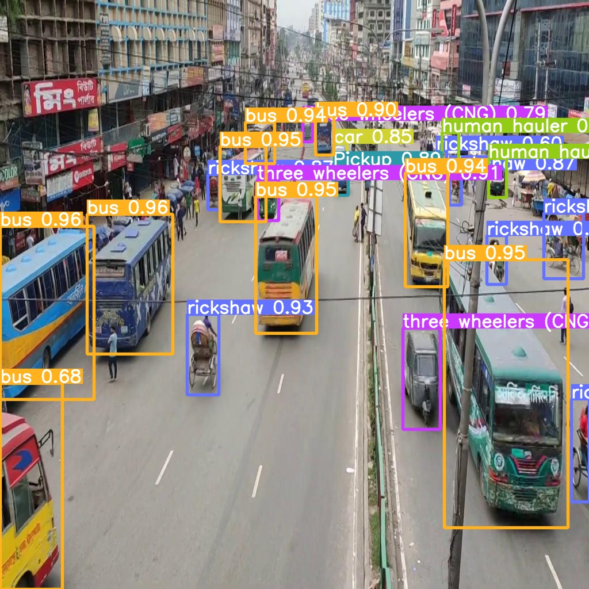
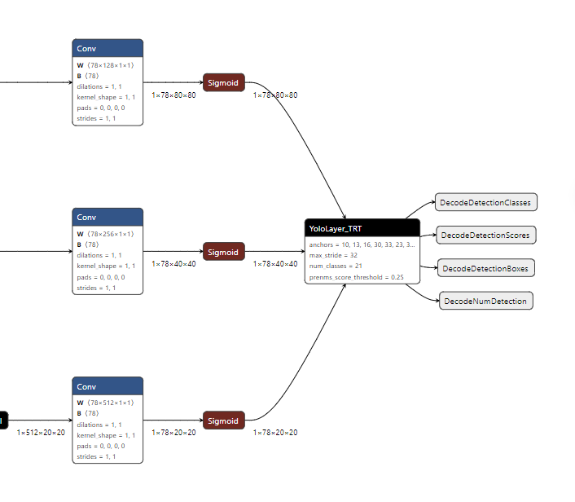
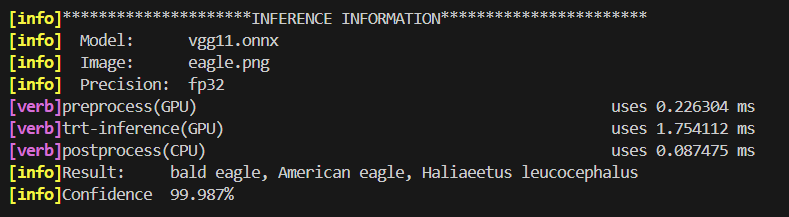

# 一、TensorTR部署YoloV5 –交通检测项目

## 1、下载YOLOV5

YOLOv5是一种流行的目标检测模型，它提供了不同大小的变体以适应不同的应用需求和硬件限制。这些变体主要在模型的宽度和深度上有所不同，影响了模型的复杂度、速度和准确性。

安装：

```shell
# 克隆地址
git clone https://github.com/ultralytics/yolov5.git
# 进入目录
cd yolov5	
# 选择分支（此分支为截至此文档撰写YOLOV5的最新版本）
git checkout db125a20175384d75560dc9af7fb1100d67213fe
# 安装依赖环境
pip3 install -r requirements.txt
# 根据官方文档，安装ultralytics
pip3 install ultralytics
```

下载原YOLOV5预训练权重：

[下载预训练权重](https://github.com/ultralytics/yolov5)，将预训练权重保存在weights文件夹下。

测试YOLOV5是否安装成功：

```shell
python3 detect.py --source ./data/images/ --weights weights/yolov5s.pt --conf-thres 0.4
```


##  2、训练自定义数据集

### 2.1 数据集介绍

Kaggle下载数据集：[Dhaka-AI-Yolo-Formatted-Dataset](https://www.kaggle.com/datasets/aifahim/dhakaaiyoloformatteddataset)

该数据集为交通场景下，交通工具类别检测。包含训练集2390张图片，验证集600张图片，图像分辨率为1024*1024。共21个类别。

#### 2.1.1 创建yaml文件

创建traffic_vehicle.yaml文件：

```bas
path: ../datasets/traffic_vehicle 	# dataset root dir
train: images/train 				# train images (relative to 'path')
val: images/train					# val images (relative to 'path')
test: # test images (optional)

# Classes
names: 
  0: ambulance
  1: auto rickshaw
  2: bicycle
  3: bus
  4: car
  5: garbagevan
  6: human hauler
  7: minibus
  8: minivan
  9: motorbike
  10: Pickup
  11: army vehicle
  12: policecar
  13: rickshaw
  14: scooter
  15: suv
  16: taxi
  17: three wheelers (CNG)
  18: truck
  19: van
  20: wheelbarrow
```

将traffic_vehicle.yaml文件复制到yolov5/data目录下。

#### 2.1.2 组织目录结构

数据集目录结构遵循YOLO数据集规则。

```bash
.
├── datasets
│   └── traffic_vehicle
│       ├── images
│       │   ├── train
│       │   └── val
│       └── labels
│           ├── train
│           ├── train.cache
│           └── val
└── yolov5
```

注意：**datasets**与**yolov5**在同级目录。


### 2.2 训练自定义数据集

#### 2.1.1 选择预训练模型

YOLOv5提供多种模型：

1. **YOLOv5s (small)**
2. **YOLOv5m (medium)**
3. **YOLOv5l (large)**
4. **YOLOv5x (extra large)**

本项目选择YOLOv5s作为预训练模型！！

复制models文件夹下对应模型**yaml**文件，重新命名，例如，本项目选择**YOLOv5s**作为预训练模型，则命名为**yolov5s_traffic_vehicle.yaml**。

需要修改类别数量为本项目的21个类别，yolov5s_traffic_vehicle.yaml内容如下：

```bash
# YOLOv5 🚀 by Ultralytics, AGPL-3.0 license

# Parameters
nc: 21 # number of classes
depth_multiple: 0.33 # model depth multiple
width_multiple: 0.50 # layer channel multiple
anchors:
  - [10, 13, 16, 30, 33, 23] # P3/8
  - [30, 61, 62, 45, 59, 119] # P4/16
  - [116, 90, 156, 198, 373, 326] # P5/32

# YOLOv5 v6.0 backbone
backbone:
  # [from, number, module, args]
  [
    [-1, 1, Conv, [64, 6, 2, 2]], # 0-P1/2
    [-1, 1, Conv, [128, 3, 2]], # 1-P2/4
    [-1, 3, C3, [128]],
    [-1, 1, Conv, [256, 3, 2]], # 3-P3/8
    [-1, 6, C3, [256]],
    [-1, 1, Conv, [512, 3, 2]], # 5-P4/16
    [-1, 9, C3, [512]],
    [-1, 1, Conv, [1024, 3, 2]], # 7-P5/32
    [-1, 3, C3, [1024]],
    [-1, 1, SPPF, [1024, 5]], # 9
  ]

# YOLOv5 v6.0 head
head: [
    [-1, 1, Conv, [512, 1, 1]],
    [-1, 1, nn.Upsample, [None, 2, "nearest"]],
    [[-1, 6], 1, Concat, [1]], # cat backbone P4
    [-1, 3, C3, [512, False]], # 13

    [-1, 1, Conv, [256, 1, 1]],
    [-1, 1, nn.Upsample, [None, 2, "nearest"]],
    [[-1, 4], 1, Concat, [1]], # cat backbone P3
    [-1, 3, C3, [256, False]], # 17 (P3/8-small)

    [-1, 1, Conv, [256, 3, 2]],
    [[-1, 14], 1, Concat, [1]], # cat head P4
    [-1, 3, C3, [512, False]], # 20 (P4/16-medium)

    [-1, 1, Conv, [512, 3, 2]],
    [[-1, 10], 1, Concat, [1]], # cat head P5
    [-1, 3, C3, [1024, False]], # 23 (P5/32-large)

    [[17, 20, 23], 1, Detect, [nc, anchors]], # Detect(P3, P4, P5)
  ]

```

#### 2.1.3 训练

下载对应的预训练模型权重文件，放到`weights`目录下，使用预训练模型，开始训练：

```shell
python3 ./train.py --data ./data/traffic_vehicle.yaml --cfg ./models/yolov5s_traffic_vehicle.yaml --weights ./weights/yolov5s.pt --batch-size 32 --epochs 300 --name epochs300_1 --project yolo_traffic_vehicle
```

#### 2.1.4 评估训练结果

选择一张图片检测，查看效果

```she
python3 detect.py --source ../datasets/traffic_vehicle/images/val/Navid_254.jpg --weights ./yolo_traffic_vehicle/epochs300_1/weights/best.pt --conf-thres 0.4
```




```bash
python3 val.py --data  ./data/traffic_vehicle.yaml  --weights ./yolo_traffic_vehicle/epochs300_1/weights/best.pt --batch-size 32
```

```bash
YOLOv5s_traffic_vehicle summary: 157 layers, 7066762 parameters, 0 gradients, 15.9 GFLOPs
val: Scanning /home/***/Course/tensorrtYoloV5/datasets/traffic_vehicle/labels/val.cache... 600 images, 0 backgrounds, 0 corrupt: 100%|█████████
                 Class     Images  Instances          P          R      mAP50   mAP50-95: 100%|██████████| 19/19 [00:06<00:00,  3.12it/s]
                   all        600       5090       0.72      0.437      0.488      0.326
             ambulance        600         22      0.697      0.318      0.356      0.235
         auto rickshaw        600         70      0.858      0.614      0.741      0.522
               bicycle        600         97      0.733      0.268      0.359      0.159
                   bus        600        698      0.867      0.665      0.763      0.525
                   car        600       1097      0.791      0.713      0.751      0.519
            garbagevan        600          1          1          0          0          0
          human hauler        600         40      0.872       0.34      0.507      0.339
               minibus        600         18      0.711      0.333      0.344      0.203
               minivan        600        158      0.519       0.43      0.412      0.285
             motorbike        600        466       0.79      0.605      0.661      0.353
                Pickup        600        238      0.589      0.433      0.482       0.33
          army vehicle        600          6      0.855        0.5      0.554       0.46
             policecar        600          6          0          0     0.0865     0.0618
              rickshaw        600        851      0.814      0.578      0.658      0.397
               scooter        600          7      0.626      0.286      0.191     0.0749
                   suv        600        182      0.609      0.385      0.439      0.324
                  taxi        600          7       0.97      0.571      0.674      0.516
  three wheelers (CNG)        600        680      0.898      0.749      0.808      0.548
                 truck        600        275      0.792      0.607      0.681      0.464
                   van        600        148      0.594      0.514      0.492      0.335
           wheelbarrow        600         23      0.528      0.261      0.293      0.203
Speed: 0.4ms pre-process, 4.6ms inference, 0.4ms NMS per image at shape (32, 3, 640, 640)


```


## 3、导出ONNX

在本项目中，我们将使用**TensoRT plugin**来代替原来**YOLOV5**代码中的**decode**操作，如果不替换，这部分运算将影响整体性能。为了让`tensorrt`能够识别并加载我们额外添加的**plugin**，我们需要修改**YOLOV5**代码中导出**onnx**模型的部分。

### 3.1 导出未修改的YOLOV5s ONNX模型

```shel
python3 export.py --weights yolo_traffic_vehicle/epochs120_1/weights/best.pt --include onnx --simplify
```

可以通过Netron进行查看导出结果。

### 3.2 导出需要的YOLOV5s ONNX模型

#### 3.2.1 修改decode处代码

在`models/yolo.py`文件中95行，我们需要修改**class Detect**的forward方法，删除其**decode**运算，直接输出网络结果。在后面的**TensorRT**部署中，我们将利用**decode plugin**来进行**decode**操作，并用**GPU**加速。修改内容如下：


修改后的**forward**函数为：

```python
def forward(self, x):
    z = []  # inference output
    for i in range(self.nl):
        x[i] = self.m[i](x[i])  # conv
        y = x[i].sigmoid()
        z.append(y)
	return z
```

修改后的**_make_grid**函数为：

```python
def _make_grid(self, nx=20, ny=20, i=0, torch_1_10=check_version(torch.__version__, "1.10.0")):
        """Generates a mesh grid for anchor boxes with optional compatibility for torch versions < 1.10."""
	d = self.anchors[i].device
    t = torch.int32
    shape = 1, self.na, ny, nx, 2  # grid shape
    y, x = torch.arange(ny, device=d, dtype=t), torch.arange(nx, device=d, dtype=t)
    yv, xv = torch.meshgrid(y, x, indexing="ij") if torch_1_10 else torch.meshgrid(y, x)  # torch>=0.7 compatibility
    grid = torch.stack((xv, yv), 2).expand(shape) - 0.5  # add grid offset, i.e. y = 2.0 * x - 0.5
    anchor_grid = (self.anchors[i] * self.stride[i]).view((1, self.na, 1, 1, 2)).expand(shape)
    return grid, anchor_grid
```

#### 3.2.2 修改export.py导出函数代码

注释以下两行代码（更改源文件位置可能变化，所以不指出具体行数）：

```python
# shape = tuple((y[0] if isinstance(y, tuple) else y).shape)  # model output shape

# LOGGER.info(f"\n{colorstr('PyTorch:')} starting from {file} with output shape {shape} ({file_size(file):.1f} MB)")
```

修改export_onnx函数：

```python
def export_onnx(model, im, file, opset, dynamic, simplify, prefix=colorstr("ONNX:")):
    """Exports a YOLOv5 model to ONNX format with dynamic axes and optional simplification."""
    check_requirements("onnx>=1.12.0")
    import onnx

    LOGGER.info(f"\n{prefix} starting export with onnx {onnx.__version__}...")
    f = str(file.with_suffix(".onnx"))

    output_names = ["output0", "output1"] if isinstance(model, SegmentationModel) else ["p3", "p4", "p5"]
    if dynamic:
        dynamic = {"images": {0: "batch", 2: "height", 3: "width"}}  # shape(1,3,640,640)
        if isinstance(model, SegmentationModel):
            dynamic["output0"] = {0: "batch", 1: "anchors"}  # shape(1,25200,85)
            dynamic["output1"] = {0: "batch", 2: "mask_height", 3: "mask_width"}  # shape(1,32,160,160)
        elif isinstance(model, DetectionModel):
            dynamic["p3"] = {0: "batch", 2: "height", 3: "width"} 
            dynamic["p4"] = {0: "batch", 2: "height", 3: "width"} 
            dynamic["p5"] = {0: "batch", 2: "height", 3: "width"} 

    torch.onnx.export(
        model.cpu() if dynamic else model,  # --dynamic only compatible with cpu
        im.cpu() if dynamic else im,
        f,
        verbose=False,
        opset_version=opset,
        do_constant_folding=True,  # WARNING: DNN inference with torch>=1.12 may require do_constant_folding=False
        input_names=["images"],
        output_names=output_names,
        dynamic_axes=dynamic or None,
    )

    # Checks
    model_onnx = onnx.load(f)  # load onnx model
    onnx.checker.check_model(model_onnx)  # check onnx model
    # onnx.save(model_onnx, f)

    # Simplify
    if simplify:
        try:
            cuda = torch.cuda.is_available()
            check_requirements(("onnxruntime-gpu" if cuda else "onnxruntime", "onnx-simplifier>=0.4.1"))
            import onnxsim

            LOGGER.info(f"{prefix} simplifying with onnx-simplifier {onnxsim.__version__}...")
            model_onnx, check = onnxsim.simplify(model_onnx)
            assert check, "assert check failed"
            onnx.save(model_onnx, f)
        except Exception as e:
            LOGGER.info(f"{prefix} simplifier failure: {e}")
    #return f, model_onnx
    
    import onnx_graphsurgeon as onnx_gs
    import numpy as np
    yolo_graph = onnx_gs.import_onnx(model_onnx)
    p3 = yolo_graph.outputs[0]
    p4 = yolo_graph.outputs[1]
    p5 = yolo_graph.outputs[2]
    decode_out_0 = onnx_gs.Variable(
        "DecodeNumDetection",
        dtype=np.int32
    )
    decode_out_1 = onnx_gs.Variable(
        "DecodeDetectionBoxes",
        dtype=np.float32
    )
    decode_out_2 = onnx_gs.Variable(
        "DecodeDetectionScores",
        dtype=np.float32
    )
    decode_out_3 = onnx_gs.Variable(
        "DecodeDetectionClasses",
        dtype=np.int32
    )

    decode_attrs = dict()

    decode_attrs["max_stride"] = int(max(model.stride))
    decode_attrs["num_classes"] = model.model[-1].nc
    decode_attrs["anchors"] = [float(v) for v in [10,13, 16,30, 33,23, 30,61, 62,45, 59,119, 116,90, 156,198, 373,326]]
    decode_attrs["prenms_score_threshold"] = 0.25

    decode_plugin = onnx_gs.Node(
        op="YoloLayer_TRT",
        name="YoloLayer",
        inputs=[p3, p4, p5],
        outputs=[decode_out_0, decode_out_1, decode_out_2, decode_out_3],
        attrs=decode_attrs
    )

    yolo_graph.nodes.append(decode_plugin)
    yolo_graph.outputs = decode_plugin.outputs
    yolo_graph.cleanup().toposort()
    model_onnx = onnx_gs.export_onnx(yolo_graph)

    # Metadata
    d = {'stride': int(max(model.stride)), 'names': model.names}
    for k, v in d.items():
        meta = model_onnx.metadata_props.add()
        meta.key, meta.value = k, str(v)

    onnx.save(model_onnx, f)
    LOGGER.info(f'{prefix} export success, saved as {f} ({file_size(f):.1f} MB)')
    return f
```


导出修改后的ONNX：

```shell
python3 export.py --data data/traffic_vehicle.yaml --weights weights/traffic_vehicle.pt --include onnx --simplify
```

主要修改的是YOLOV5 decode部分：



模型有4个输出：

- DecodeNumDetection：检测框数量
- DecodeDetectionBoxes：检测框坐标
- DecodeDetectionScores：检测框置信度
- DecodeDetectionClasses：检测框类别

## 4、TensorRT模型构建

### 4.1 配置文件

在config文件夹下，config.yaml配置文件：

```yaml
onnxPath: ./models/onnx/traffic_vehicle.onnx

logging:
  level: 4          # FATAL:0  ERROR:1   WARN:2  INFO:3  VERB:4  DEBUG:5

model_params:
  image:
    - 640
    - 640
    - 3
  num_cls: 1000
  task: 1            # CLASSIFICATION:0  DETECTION:1  SEGMENTATION:2  MULTITASK:3
  device: 1          # CPU:0  GPU:1
  precision: 0       # FP32:0 FP16:1  INT8:2
  calibration_list: ./calibration/calibration_list_traffic.txt
  calibration_table: ./calibration/calibration_table_traffic.txt
  calibration_batchsize: 64

images_path:
  - ./data/source/33.jpg
  - ./data/source/40.jpg
  - ./data/source/47.jpg
  - ./data/source/52.jpg
  - ./data/source/52.jpg
  - ./data/source/135.jpg
  - ./data/source/145.jpg
  - ./data/source/147.jpg
```

根据配置文件进行参数设置，避免频繁更改源文件，重复编译。

### 4.2 CMake编译

构建系统文件生成在指定的`build`目录中:

```bash
cmake -S . -B build
```
编译，生成可执行文件到./bin目录下：

```bash
cmake --build build
```

### 4.3 执行可执行文件生成engine并推理

```bash
./bin/trt-infer
```

执行上述命令，进行图像的TensorRT推理。当第一次执行时，会进行engine文件的生成，需要等待一段时间，生成一次engine文件后，之后执行，系统会直接加载engine文件。


### 4.4 INT8推理

FP32和FP16可直接进行推理，当使用INT8量化推理时，需要执行校准操作，我们要事先准备好校准图像。


# 二、TensorRT图像分类任务

图像分类任务输入输出都大致相同，因此示例可以适用多个分类模型。

## 1、从torchvision导出ONNX模型

导出分类模型ONNX代码在**./src/python/torchvision2onnx.py**，这里提供的模型包括**resnet50**、**resnet101**、**resnet152**、**vgg11**、**vgg19**、**mobilenet_v3_small**、**efficientnet_b0**、**efficientnet_v2_s**，如需其他模型，可自行扩展。

以**vgg11**模型为例，执行（注意路径）：

```python
python3 ./src/python/torchvision2onnx.py --type vgg11 --dir ./models/onnx/
```

导出onnx模型保存在**./model/onnx/**文件夹中。

## 2、配置文件

在config文件夹下，config.yaml配置文件：

```yaml
onnxPath: ./models/onnx/vgg11.onnx

logging:
  level: 4          # FATAL:0  ERROR:1   WARN:2  INFO:3  VERB:4  DEBUG:5

model_params:
  image:
    - 224
    - 224
    - 3
  num_cls: 1000
  task: 0            # CLASSIFICATION:0  DETECTION:1  SEGMENTATION:2  MULTITASK:3
  device: 1          # CPU:0  GPU:1
  precision: 0       # FP32:0 FP16:1  INT8:2
  calibration_list: ./calibration/calibration_list_imagenet.txt
  calibration_table: ./calibration/calibration_table_imagenet.txt
  calibration_batchsize: 64

images_path:
  - ./data/source/cat.png
  - ./data/source/fox.png
  - ./data/source/eagle.png
  - ./data/source/tiny-cat.png
  - ./data/source/wolf.png
```

根据配置文件进行参数设置，避免频繁更改源文件，重复编译。


## 3、CMake编译

构建系统文件生成在指定的`build`目录中:

```bash
cmake -S . -B build
```

编译，生成可执行文件到./bin目录下：

```bash
cmake --build build
```

## 4、 执行可执行文件生成engine并推理

```bash
./bin/trt-infer
```

执行上述命令，进行图像的TensorRT推理。当第一次执行时，会进行engine文件的生成，需要等待一段时间，生成一次engine文件后，之后执行，系统会直接加载engine文件。



模型导出是不经过**softmax**操作的，因此计算置信度，需要使用c++实现一个**softmax**步骤。

## 5、 INT8推理

FP32和FP16可直接进行推理，当使用INT8量化推理时，需要执行校准操作，我们要事先准备好校准图像。

